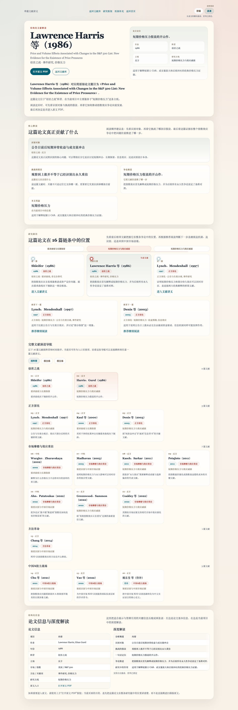

# Index Inclusion Research Toolkit

[](https://github.com/Leonard-Don/index-inclusion-research/actions/workflows/ci.yml)


`index-inclusion-research` 是一个把指数纳入效应文献、真实样本结果与识别设计放到同一工作流里的实证研究项目。它把 16 篇文献库、3 条研究主线、真实样本表和 HS300 RDD 扩展统一到同一 dashboard 与 CLI 体系，适合：

- 指数纳入效应论文的文献综述与研究展示
- 事件研究、匹配回归与中国市场识别的实证复现
- 课堂汇报、导师讨论和项目维护的同一套界面输出

项目围绕 3 条研究主线展开：

- `短期价格压力与效应减弱`
- `需求曲线与长期保留`
- `制度识别与中国市场证据`

回答 3 个核心问题：

- 指数纳入后的上涨是不是只是短期交易冲击？
- 价格效应会不会只部分回吐，从而支持需求曲线向下倾斜？
- 不同市场制度和识别方法会不会改变结论，尤其是在中国市场？

## 研究当前结论速览

跨市场不对称（CMA）pipeline 在真实样本上的 7 条机制假说裁决（`index-inclusion-verdict-summary` 也能终端打印）：

| 假说 | 名称 | 裁决 | 头条指标 | 主线 |
|---|---|---|---|---|
| H1 | 信息泄露与预运行 | 证据不足 | bootstrap p = 0.875 (n=436) | 制度识别 |
| H2 | 被动基金 AUM 差异 | 证据不足 | US AUM ratio = 13.48 (n=12) | 需求曲线 |
| H3 | 散户 vs 机构结构 | 部分支持 | 双通道命中率 = 0.500 | 短期价格压力 |
| H4 | 卖空约束 | 证据不足 | regression p = 0.537 (n=436) | 制度识别 |
| H5 | 涨跌停限制 | 证据不足 | limit_coef p = 0.213 (n=936) | 制度识别 |
| H6 | 指数权重可预测性 | 证据不足 | heavy−light spread = -0.019 (n=67) | 需求曲线 |
| H7 | 行业结构差异 | 支持 | US sector spread = 5.95 (n=187) | 制度识别 |

`make rebuild` 跑 10 步流水线刷新所有产出。详见 [results/real_tables/cma_hypothesis_verdicts.csv](results/real_tables/cma_hypothesis_verdicts.csv) 和 [docs/paper_outline_verdicts.md](docs/paper_outline_verdicts.md)。

阈值灵敏度（"如果阈值是 0.05 而不是 0.10？"）做成五层入口（决定 / 数据 / CLI / dashboard / doctor），终端一行：`index-inclusion-verdict-summary --sensitivity`。完整说明见 [docs/sensitivity_workflow.md](docs/sensitivity_workflow.md)。

## GitHub 首页先看什么

第一次点进这个仓库，建议按这 4 步看：

1. 看下面的"界面预览"，知道项目最终交付长什么样。
2. 看"快速开始"，在本地拉起 dashboard。
3. 看 [docs/literature_to_project_guide.md](docs/literature_to_project_guide.md)，理解 16 篇文献如何映射到当前项目。
4. 如果要继续维护 dashboard 主干，再看 [docs/dashboard_architecture.md](docs/dashboard_architecture.md)。

## 界面预览

<table>
  <tr>
    <td><strong>首页总览</strong></td>
    <td><strong>单篇文献速读</strong></td>
    <td><strong>移动端阅读</strong></td>
  </tr>
  <tr>
    <td></td>
    <td></td>
    <td></td>
  </tr>
</table>

仓库没有公开在线 demo，推荐直接在本地运行并打开 `http://localhost:5001`。

## 快速开始

### 1. 安装

```bash
# 锁定版本（推荐：使用 uv.lock）
make sync

# 或传统方式
python3 -m pip install -e ".[dev]"
```

### 2. 启动 dashboard

```bash
index-inclusion-dashboard
```

然后打开 <http://localhost:5001>。

### 3. 先看哪些页面

- `/`：一页式总展板（默认 `展示版`）
- `/?mode=brief`：3 分钟汇报
- `/?mode=full`：完整材料
- `/paper/<paper_id>`：单篇文献速读页 + 原文 PDF

### 4. 常用验证

```bash
make lint
make test
make smoke   # 浏览器 smoke test，需要 Playwright + Chromium
```

## 维护与扩展前先看什么

如果你已经准备继续维护或扩展这个项目：

1. [docs/literature_to_project_guide.md](docs/literature_to_project_guide.md)：16 篇文献如何统一映射到当前项目。
2. [docs/dashboard_architecture.md](docs/dashboard_architecture.md)：dashboard 主干。
3. [docs/cli_reference.md](docs/cli_reference.md)：24 个 console scripts 的完整说明。
4. 启动界面：`index-inclusion-dashboard` → 打开 <http://localhost:5001>。

## 项目结构

```text
config/markets.yml
data/                  raw/ + processed/
docs/                  literature, dashboard architecture, CLI reference, sensitivity, hs300 rdd
results/               event_study/, regressions/, figures/, tables/, real_*/, literature/
src/index_inclusion_research/
  analysis/            事件研究、回归、RDD、CMA
  loaders/             数据读写
  pipeline/            样本构建、匹配（含 covariate balance）
  web/templates/+static/
  literature.py / literature_catalog.py / paths.py
tests/                 ~570 个单元测试 + 浏览器 smoke
```

`paths.py` 提供 `paths.project_root()` 与 `paths.results_dir()` 等工具，所有模块都用它读项目根。设置 `INDEX_INCLUSION_ROOT` 环境变量可以覆盖默认根（容器化或并行测试时有用）。

## 16 篇文献驱动的三条主线

### 1. 短期价格压力与效应减弱

回答："指数纳入后的上涨是不是主要来自短期交易冲击？" 主要依赖 `CAR[-1,+1]` / `CAR[-3,+3]` / `CAR[-5,+5]`、公告日 / 生效日平均异常收益路径、成交量与换手率短期变化。研究主线入口：`index-inclusion-price-pressure`。

### 2. 需求曲线与长期保留

回答："价格上涨会不会只部分回吐？" 主要依赖长窗口 `CAR[0,+20]` / `CAR[0,+60]` / `CAR[0,+120]`、retention ratio、short-window vs long-window 对比。研究主线入口：`index-inclusion-demand-curve`。

### 3. 制度识别与中国市场证据

回答："指数效应的结论会不会因制度背景和识别方法而改变？" 主要依赖中国样本事件研究、匹配对照组、DID 风格汇总、HS300 RDD 扩展（详见 [docs/hs300_rdd_workflow.md](docs/hs300_rdd_workflow.md)）。研究主线入口：`index-inclusion-identification`。

## 文献相关文件

- [docs/index_effect_literature_map.md](docs/index_effect_literature_map.md)：16 篇文献的立场分类
- [docs/literature_to_project_guide.md](docs/literature_to_project_guide.md)：文献 → 三条主线的映射
- [docs/literature_review_author_year_cn.md](docs/literature_review_author_year_cn.md)：作者（年份）版中文文献综述
- [docs/literature_deep_analysis_cn.md](docs/literature_deep_analysis_cn.md)：每篇论文的深度分析
- [docs/literature_five_camps_framework_cn.md](docs/literature_five_camps_framework_cn.md)：五大阵营与会议表达框架
- [src/index_inclusion_research/literature_catalog.py](src/index_inclusion_research/literature_catalog.py)：项目内的结构化文献目录与项目映射

## 数据输入契约

`events.csv` 必需列：`market`、`index_name`、`ticker`、`announce_date`、`effective_date`；可选：`event_type`、`source`、`sector`、`note`。

`prices.csv` 必需列：`market`、`ticker`、`date`、`close`、`ret`、`volume`、`turnover`、`mkt_cap`；可选：`sector`。

`benchmarks.csv` 必需列：`market`、`date`、`benchmark_ret`。

## 命令行入口

完整 CLI 参考见 [docs/cli_reference.md](docs/cli_reference.md)。常用速查：

```bash
make rebuild        # 10 步全流水线刷新
make verdicts       # 终端速览 7 条假说裁决
make doctor         # 项目健康检查
make sync           # 用 uv.lock 装锁定依赖

index-inclusion-dashboard                            # 启 dashboard
index-inclusion-cma --threshold 0.05                 # 重新生成 verdict
index-inclusion-verdict-summary --sensitivity        # 阈值 sweep + Bonferroni/BH
index-inclusion-verdict-summary --compare-with ...   # verdict 时点 diff（详见 docs/verdict_iteration.md）
index-inclusion-refresh-real-evidence                # 真实数据 + evidence manifest 一次刷
index-inclusion-doctor --fail-on-warn                # 严格门禁（warn 也阻断）
```

按用途分组（共 24 个 console scripts）：

- 数据流水线：`build-event-sample` / `build-price-panel` / `match-controls` / `run-event-study` / `run-regressions`
- 样本数据：`generate-sample-data` / `download-real-data`
- 报表与图表：`make-figures-tables` / `generate-research-report`
- Dashboard 与三条主线：`dashboard` / `price-pressure` / `demand-curve` / `identification`
- HS300 RDD 工具链：`hs300-rdd` / `prepare-hs300-rdd` / `reconstruct-hs300-rdd` / `plan-hs300-rdd-l3`
- 跨市场不对称 + 假说证据：`cma` / `prepare-passive-aum` / `compute-h6-weight-change` / `refresh-real-evidence`
- 总入口：`rebuild-all` / `verdict-summary` / `doctor`

`match-controls` 现在会同时输出 covariate balance 表（`match_balance.csv`，Stuart 2010 SMD）；`doctor` 的 `matched_sample_balance` 检查在 |SMD|≥0.25 时变 warn。`compute_pre_runup_bootstrap_test` 默认按 `announce_date` 做 block bootstrap，`cluster_method` 列记录采样方式。

## 开发与验证

继续开发先装上开发依赖：

```bash
make sync
```

日常回归：

```bash
make lint
make test
```

浏览器 smoke test 默认不在本地 `pytest` 自动跑：

```bash
make smoke
```

GitHub Actions 通过 `astral-sh/setup-uv` + `uv sync --extra dev`（按 `uv.lock`）安装依赖，分两步：

- `ruff` lint + 单元测试 + `index-inclusion-doctor --format json`
- 安装 Chromium 后跑 dashboard 浏览器 smoke test

如果你准备改 dashboard 主干，先看 [docs/dashboard_architecture.md](docs/dashboard_architecture.md)。

## 哪些文件是"核心文件"

时间不多就优先看这几项：

- [README.md](README.md)
- [docs/literature_to_project_guide.md](docs/literature_to_project_guide.md)
- [docs/dashboard_architecture.md](docs/dashboard_architecture.md)
- [docs/cli_reference.md](docs/cli_reference.md)
- [src/index_inclusion_research/literature_dashboard.py](src/index_inclusion_research/literature_dashboard.py)
- [src/index_inclusion_research/literature_catalog.py](src/index_inclusion_research/literature_catalog.py)
- [results/real_tables/research_summary.md](results/real_tables/research_summary.md)

## 哪些文件主要是生成产物

下面这些目录里的多数文件都可以重新生成：

- `data/processed/`、`results/event_study/`、`results/regressions/`、`results/figures/`、`results/tables/`、`results/literature/`

平时真正需要维护的"源文件"主要是 `src/index_inclusion_research/`、`docs/`、`config/markets.yml`。

## 论文写作建议

论文模板见 [docs/paper_outline.md](docs/paper_outline.md)。最推荐的写法：

1. 文献综述按 `反方 / 中性 / 正方` 展开
2. 实证设计按三条研究主线展开
3. 结果部分按 `短期冲击 → 长期保留 → 中国市场识别扩展` 展开

## 测试

```bash
make test
```

当前包含：事件研究 + 机制汇总测试、RDD 测试、文献目录与主线映射测试、报表与页面测试、流水线 main() 集成测试、covariate balance + 多重检验校正测试。

## 备注

如果你接下来继续做清理，最值得保持稳定的是：

- `src/index_inclusion_research/literature_catalog.py`
- `src/index_inclusion_research/literature_dashboard.py`
- `docs/literature_to_project_guide.md`

这三处定义了整个项目的统一主线。
