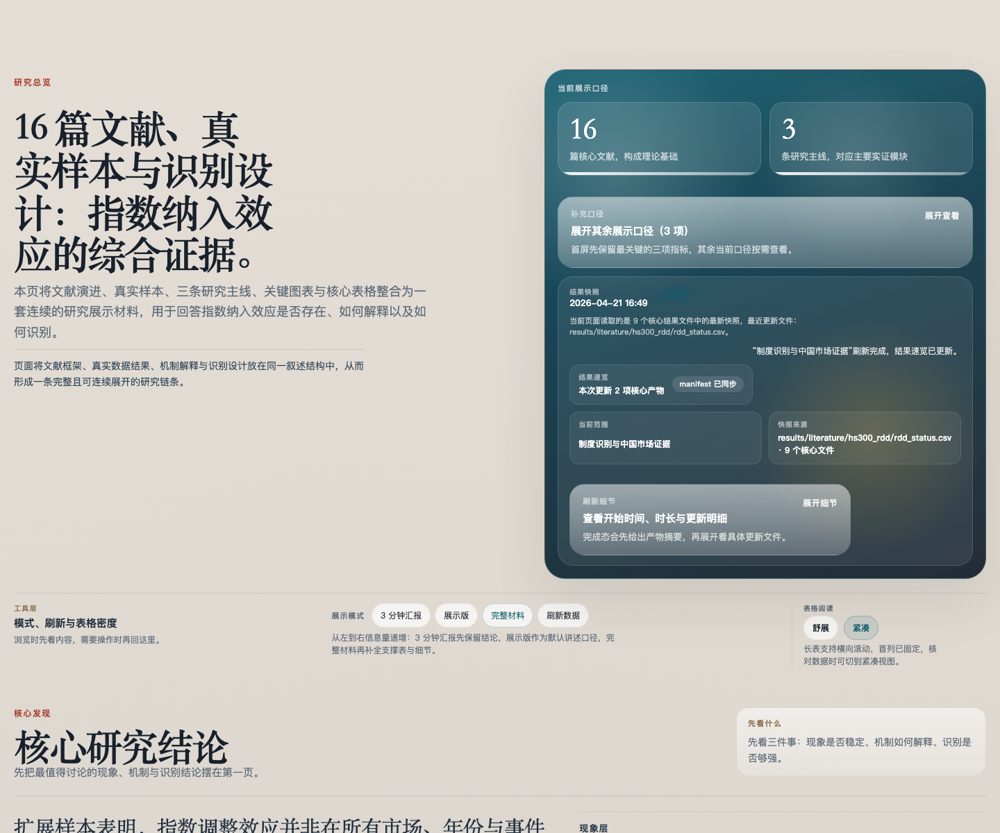
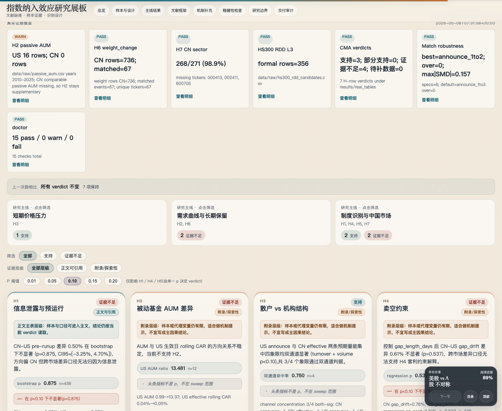

# 指数纳入效应研究工具集（Index-Inclusion Research Toolkit）

[English](README.md) · **简体中文**

[](https://github.com/Leonard-Don/index-inclusion-research/actions/workflows/ci.yml)


> **这是什么。** 一个端到端的实证金融研究项目 ——「一只股票被纳入主要指数时，价格到底会不会动？这个上涨是不是只是暂时的？经得起严格检验吗（尤其在中国市场）？」 —— 由我一个人用 Python 从头搭建：可复现的事件研究流水线、匹配对照组设计、交互式研究 dashboard、约 1,190 个测试，以及一个**如实报告**的答案 —— 包括它在哪里是 null、以及我自己的识别策略在哪里站不住脚。

这是一个**描述性**研究，不是一篇主张因果的论文 —— 见下方[诚实版本](#诚实版本先看这个)。

---

## 一句话总结（TL;DR）

- **问题。** 指数纳入是研究「需求冲击」的经典实验场：CSI 300 / S&P 500 调仓时，被动基金**必须**买入新成分股。教科书的预测是价格上涨。我检验它是否真的发生、是否会回吐、由什么机制驱动 —— 并且**跨两个市场（中国 + 美国）**做。
- **发现。** **公告窗**效应在美国真实且稳健（US 公告 `CAR[-1,+1] ≈ +1.3%`，置换检验 `p = 0.0002`，在事件聚类标准误下依然成立），在中国边缘显著（`p ≈ 0.03`）。但**生效窗在所有口径下都为零**（`p > 0.27`），且 **7 条机制假说里 5 条证据不足**。这个「在缩小、且大多被提前消化」的格局，与「消失的指数效应」（Greenwood & Sammon, 2022）一致，并在此**跨市场复制**。
- **它展示了什么。** 完整的实证研究链条（事件研究、带协变量平衡的匹配、伪事件日 placebo、置换检验、聚类标准误、多重检验校正）、一条带自动化质量门禁的可复现流水线，以及 —— 我最看重的一点 —— **知道并说清数据的边界**，而不是硬凑显著性。

---

## 诚实版本（先看这个）

一个研究项目的价值，取决于它敢不敢承认问题。三件我选择摆在最前面、而不是藏起来的事：

1. **我的旗舰识别设计不成立，我直说。** 我围绕指数成分的临界点搭了一套 HS300 断点回归（RDD）。仔细一看，那个「running variable」是人为铺出来的排名序号（等距 `299.85 … 300.28`），**与处理变量 100% 共线、断点两侧零重叠** —— 数学上根本不是 RDD。我保留了整套机器用于复现，但**把它降级为附录里「一次失败的识别尝试」**，而不是当成因果证据。（[详细原因](docs/identification_roadmap.md)）
2. **假说是事后（post-hoc）/ 探索性的。** 这 7 条机制假说是在**看到**公告 vs 生效、中国 vs 美国的不对称结果**之后**才形成的，没有预分析计划。主表只报告 `evidence_tier = core` 的结果；小样本 / 探索性的（如 H3，**n = 4**）留在附录并明确标注。
3. **数据有真实的局限。** 美国市值/权重是 Yahoo 近似值；约 39% 的美国公告事件因事件窗内缺有效收益被剔除 —— 而且这个剔除是**非随机的（退市 / 被并购的标的）**，即我明确记录的幸存者/样本选择偏差（有效 `N = 371`）。（[完整局限](docs/limitations.md)）

把这些放到最前面是刻意的：这正是我作为研究者最想从一个候选人身上看到的信号。

---

## 核心结果 —— 7 条机制假说

跨市场不对称（CMA）流水线在真实样本上对每条假说给出裁决（`index-inclusion-verdict-summary` 在终端打印同一张表）。

| 假说 | 机制 | 裁决 | 解读（头条指标，n） |
|----|------|------|---------------------|
| H1 | 信息泄露 / 预运行 | 证据不足 | 置换检验 `p = 0.97`（n=455） |
| H2 | 被动基金 AUM 差异（需求曲线） | 证据不足 | US AUM 比 **13.5×**，但生效窗 CAR 无衰减（合并 n=18） |
| H3 | 散户 vs 机构结构 | 支持 | 名义上支持，但 **n = 4、功效≈0** → 仅入附录 |
| H4 | 卖空约束 | 证据不足 | 回归 `p = 0.60`（n=455） |
| H5 | 涨跌停限制 | 证据不足 | limit-coef `p = 0.43`（n=1096） |
| H6 | 指数权重可预测性 | 证据不足 | heavy−light 价差 −0.016（n=87） |
| H7 | 行业结构差异 | 支持 | 支持 —— US 行业价差 5.97，交互 `p = 0.095` |

真值来源：[results/real_tables/cma_hypothesis_verdicts.csv](results/real_tables/cma_hypothesis_verdicts.csv)。`--sensitivity` 会把每条裁决在显著性阈值（0.05 → 0.20）上重跑一遍，并配 Bonferroni/BH 校正；详见 [docs/sensitivity_workflow.md](docs/sensitivity_workflow.md)。

> 有两条发现（H5 涨跌停、H2 需求）在我把免费 Yahoo 数据换成持牌 Tushare A 股数据后，从「支持」翻转为「证据不足」。我把这次翻转留在记录里，而不是悄悄保留更好看的数字。

---

## 稳健性 —— 公告窗效应为什么可信

描述性结论（「公告窗强、生效窗为零」）由四项相互独立的检验背书，全部由流水线生成到 `results/real_tables/robustness_*.csv` 与 `results/real_figures/parallel_trends_aar_*.png`：

| 检验 | 说明 | US 公告 `[-1,+1]` | 生效窗 |
|---|---|---|---|
| 逐日 AAR 平行趋势 | 处理组与匹配对照组事件前重合、仅在窗内分叉 | 干净的事前平行、day-0 跳升 | — |
| 伪事件日 placebo | 真实 CAR 落在 placebo 分布尾部 | `p = 0.005` | `p > 0.29` |
| 置换检验（sign-flip，5,000 次） | H₀ 下的经验显著性 | `p = 0.0002` | `p > 0.27` |
| 事件聚类标准误（CRV1，按日期） | 对同日相关稳健的推断 | `p = 0.0003` | 不显著 |

三项显著性检验结论一致，且生效窗的「零」在每项检验下都成立 —— 是「被提前消化、基本消失」的跨市场格局，而非因果性的指数需求效应。

---

## 界面预览

整个项目通过一个本地 Flask dashboard（`http://localhost:5001`）导航 —— 文献、样本、图表与裁决在同一工作流里。

<table>
  <tr>
    <td align="center" width="50%">
      
      <br><strong>研究总览</strong><br>
      <sub>16 篇文献、真实样本、识别设计与核心结果同一入口</sub>
    </td>
    <td align="center" width="50%">
      
      <br><strong>CMA 证据层级与 H7 行业交互</strong><br>
      <sub>7 条假说的支持强度、稳健性与行业交互一屏核对</sub>
    </td>
  </tr>
</table>

<details>
<summary>更多截图（完整长图）</summary>

- [首页完整长截图](docs/screenshots/dashboard-home.png)
- [单篇文献速读页](docs/screenshots/paper-brief.png)
- [移动端](docs/screenshots/dashboard-mobile.png)

</details>

没有公开在线 demo —— 在本地运行（见下）。

---

## 运行

```bash
make sync                      # 按 uv.lock 安装锁定依赖（可复现）
index-inclusion-dashboard      # 然后打开 http://localhost:5001

make rebuild                   # 重跑完整离线流水线（events → CMA → figures → report）
make verdicts                  # 在终端打印 7 条假说裁决表
make ci                        # lint + 类型检查 + 覆盖率门禁 + 项目健康检查
```

Dashboard 模式：`/`（总览）、`/?mode=brief`（3 分钟速读）、`/?mode=full`（完整材料）、`/paper/<id>`（单篇文献速读页 + 原文 PDF）。

---

## 工程实现

研究本身约 1.1 万行；其余是让它端到端可复现、可审计的基础设施 —— 按我心目中一个研究代码库应有的标准来搭。

- **确定性、离线流水线。** `index-inclusion-rebuild-all` 在约 3 分钟内从 `data/` 重算全部结果、无任何网络调用；冻结的裁决基线在重算后保持不变 —— `pap-diff` 漂移审计确认 7 条假说全部稳定。
- **自动化质量门禁。** 一套自建的 `doctor` 框架跑 30 项健康检查（产物新鲜度、schema 契约、图表注册表、跨文档一致性），`paper-integrity` 门禁交叉校验 README/论文里的数字确实与提交的 CSV 一致。`make ci` 全绿。
- **测试充分。** 约 1,190 个单元 + 集成测试（事件研究、匹配 + 协变量平衡、稳健性、流水线 `main()` 集成、dashboard 渲染），`ruff` 与 `mypy` 干净。
- **诚实的随机种子与快照。** 所有随机都固定 seed；裁决基线做快照，任何结论漂移都能随时间被看见。

### 方法栈

事件研究（市场调整 + 市场模型 AR、Patell Z、BMP t）· 带 Stuart-2010 SMD 平衡的匹配对照组 · 长窗口保留率 · 伪事件日 placebo · sign-flip 置换检验 · 事件聚类（CRV1）标准误 · 后验功效分析（MDE）· Bonferroni/BH 多重检验校正。

---

## 仓库结构

```text
src/index_inclusion_research/
  analysis/          事件研究、回归、RDD、跨市场不对称、稳健性、功效
  pipeline/          样本构建、匹配（含协变量平衡）
  outputs/           图表与表格 builder
  dashboard/ web/    Flask 应用 + templates/static（交互式前端）
  doctor/            项目健康检查框架
data/                raw/ + processed/
results/             event_study/、regressions/、figures/、tables/、real_*/、literature/
docs/                文献地图、方法论、局限、识别路线图
tests/               约 1,190 个单元 + 集成测试
```

更深的文档：[研究交付包](docs/research_delivery_package.md) · [论文大纲](docs/paper_outline.md) · [局限](docs/limitations.md) · [识别路线图](docs/identification_roadmap.md) · [CLI 参考（43 条命令）](docs/cli_reference.md)。

---

## 关于本项目

一个个人独立完成的项目：取指数纳入效应文献中的一个既有问题，端到端地实现 —— 数据、事件研究、匹配对照设计、稳健性，以及交互式研究前端 —— 目标是把**过程**做对（可复现、诚实推断、干净代码），而不是硬逼出一个吸睛的结果。MIT 许可。
