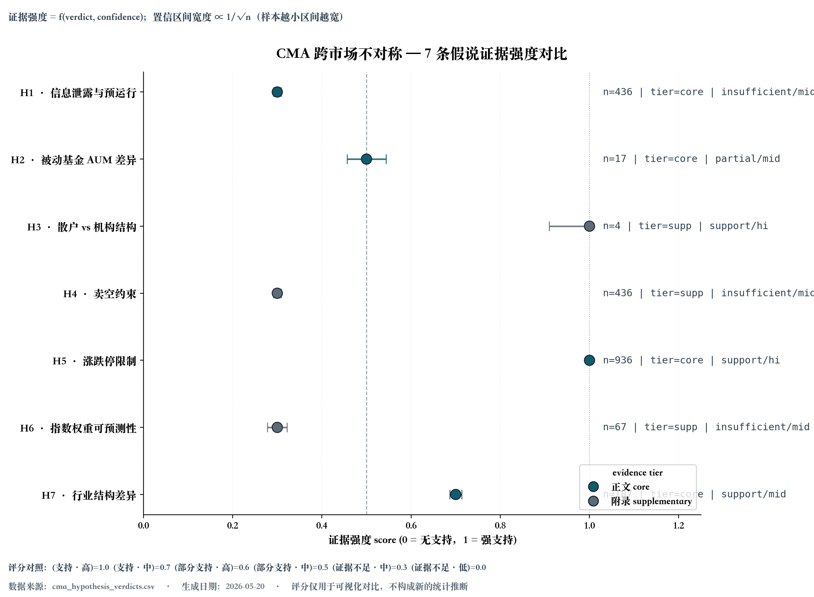

# 论文与答辩交付包

本文档是当前研究版本的写作和答辩总入口。它不替代自动产出的结果表，
而是规定哪些证据进入正文、哪些证据只进附录，以及答辩时应该如何表述边界。

## 1. 一句话结论

指数纳入事件在中美市场都主要表现为**公告日显著正向超额收益**，而不是生效日集中跳涨：
CN inclusion 的公告日 `CAR[-1,+1]` 为 **+1.75%** (t=4.93, p<0.001)，
US inclusion 为 **+1.47%** (t=5.19, p<0.001)；生效日窗口在两国市场都不显著。

论文主线因此应写成：

> 指数纳入效应仍然存在，但主要在公告阶段完成定价；不同市场的制度、行业结构和交易限制
> 影响这一价格反应的传导机制。被动资金需求冲击是候选机制之一，但当前结果不支持把上涨
> 主要归因于生效日机械买盘。

## 2. 正文证据边界

7 条 CMA 假说的证据强度概览图（推荐放论文 §4.3 机制裁决主图，附录另放
H7 行业交互稳健性）：



> 图说：H1-H7 在 y 轴，support-strength 评分 (0-1) 在 x 轴。颜色按
> `evidence_tier`（core = 深青色 / supplementary = 灰色），右侧 monospace
> 列为 `n=N | tier | verdict/conf`。评分 = f(verdict, confidence)，
> 仅用于跨假说可视化对比，不构成新的统计推断。重绘：
> `index-inclusion-build-cma-verdicts-forest`，详见
> [docs/cli_reference.md](cli_reference.md)。

正文只保留三类证据：

| 位置 | 证据 | 当前口径 | 来源 |
|---|---|---|---|
| 主结果 | 事件研究 `CAR[-1,+1]` | 公告日显著，生效日不显著 | `results/real_tables/event_study_summary.csv` |
| 方法稳健性 | Patell/BMP 标准化异常收益 | CN/US inclusion 公告日仍显著 | `results/real_event_study/patell_bmp_summary.csv` |
| 机制主表 | `evidence_tier=core` 的 CMA 假说 | H1 证据不足，H5 支持，H7 支持；H7 另有行业交互回归补强 | `results/real_tables/cma_hypothesis_verdicts.csv`、`cma_h7_sector_interaction.csv`；证据强度概览图 `results/figures/cma_verdicts_forest.{png,pdf}` |

正文不要把 7 条 CMA 假说全部并列成主表。当前 PAP 明确规定：

- **正文 core**：H1 信息泄露与预运行、H5 涨跌停限制、H7 行业结构差异；
  H2 被动基金 AUM 在补入 CN ETF TNA proxy 后由 supplementary 升级为 core
  (combined-n 阈值 15,US rolling 12 + CN rolling 5 = 17,通过 `EVIDENCE_TIER_PROMOTION_FLOOR`)。
- **附录 supplementary**：H3 散户 vs 机构结构、H4 卖空约束、H6 指数权重可预测性。
- **HS300 RDD**：附录 / 方法论补充，定位为 preliminary，不进入主表。

H2 现在以 proxy 形式呈现：CN 一侧用 `data/raw/cn_passive_aum_proxy.csv`
(CSI300 + CSI500 跟踪 ETF 的年终 TNA 聚合,经 akshare 抓取),US 一侧仍是
Federal Reserve Z.1。论文写作时必须披露：
(1) CN proxy 不是基金业协会披露的官方被动 AUM 口径；
(2) ETF 宇宙逐年扩张，2020-2023 快照可能低估；
(3) 当前 verdict 是"部分支持"——CN 端方向符合 H2(AUM 上升 + effective CAR 下降),
    US 端方向不一致(effective CAR 没有持续衰减),所以不能写"中美都被验证"。

## 3. 推荐论文结构

### 引言

先回答“是否上涨”：公告日 CAR 在 CN 和 US 都显著为正。随后提出真正的问题：
既然生效日不显著，为什么市场提前定价，且中美市场的机制证据不同？

### 数据与样本

引用 `results/real_tables/sample_scope.csv`、`event_counts.csv`、`data_sources.csv`。
必须同时引用 [docs/limitations.md](limitations.md)，尤其说明 `mkt_cap` 和 `turnover`
使用 Yahoo `sharesOutstanding` 近似，不是交易所历史自由流通口径。

### 研究设计

主设计包括：

1. 公告日 / 生效日双窗口事件研究。
2. 匹配样本回归与 covariate balance 检查。
3. CMA 机制假说裁决，正文只引用 core 层。
4. HS300 RDD 作为附录识别补充。

不要把 HS300 RDD 写成唯一因果识别主轴；当前 L3 只有 11 批次 / 356 行，
仍低于 ≥20 批次 / ≥10 年的论文级门槛。

### 实证结果

正文结果建议按这个顺序写：

1. **主结果**：公告日显著正向，生效日不显著。
2. **标准化稳健性**：Patell/BMP 仍支持 announcement inclusion effect。
3. **机制裁决**：H5 和 H7 支持，H1 不支持信息泄露解释。
4. **限制性识别补充**：RDD main spec 显著，但 donut / polynomial 提示设定敏感。

### 结论

结论应强调“公告期定价 + 制度机制差异”，而不是泛泛写“指数基金买入导致上涨”。
更稳妥的表述是：

> 本研究支持指数纳入公告带来的短期价格反应，但当前证据更像是公告阶段的信息、
> 注意力和制度约束共同作用，而不是生效日被动资金机械买盘的单一解释。

## 4. 主表与附录清单

| 类型 | 建议标题 | 使用文件 |
|---|---|---|
| 表 1 | 样本覆盖与数据来源 | `event_counts.tex`、`sample_scope.csv`、`data_sources.tex` |
| 表 2 | 公告日 / 生效日事件研究 | `event_study_summary.tex` |
| 表 3 | CMA core 假说裁决 | `cma_hypothesis_verdicts.csv` 中 `evidence_tier=core` |
| 图 1 | CAR path by market and event phase | `real_figures/*_car_path.png` |
| 图 2 | CMA 机制热力图 | `real_figures/cma_mechanism_heatmap.png` |
| 图 3 | CMA 跨假说证据强度森林图 | `results/figures/cma_verdicts_forest.png`（同名 `.pdf` 为矢量版本） |
| 附录 A | supplementary 假说裁决 | H2/H3/H4/H6 相关 `cma_*.csv` |
| 附录 B | H7 行业交互稳健性 | `cma_h7_sector_interaction.csv` |
| 附录 C | HS300 RDD | `results/literature/hs300_rdd/`；稳健性森林图 `results/figures/hs300_rdd_robustness_forest.png`（同名 `.pdf` 为论文用矢量版本） |
| 附录 D | 数据与方法限制 | `docs/limitations.md` |
| 附录 E | PAP 与 verdict diff | `docs/pre_registration.md`、`docs/verdict_iteration.md`、`results/real_tables/pap_deviation_report.csv`（每行一条假说 unchanged/tightened/weakened/flipped/unverifiable 分类） |

`make paper` 会把上述核心材料聚合到 `paper/` 目录，其中叙事文件在
`paper/narrative/`，表格在 `paper/tables/`（含 `pap_deviation_report.csv` PAP 偏离审计
快照），论文级跨假说 / RDD 稳健性森林图在 `paper/figures/` 中以 PNG + PDF 双格式提供
（`cma_verdicts_forest.{png,pdf}`、`hs300_rdd_robustness_forest.{png,pdf}`），RDD 材料在
`paper/rdd/`。`paper/manifest.json` 给每个拷贝过来的产物记录 sha256 / size / source /
target，便于检查交付包是否 drift。`paper-bundle` 默认在拷贝前会自动重跑这两张森林图
和 PAP 偏离审计 CSV，所以即使 `make rebuild` 早于最新一次 verdict 修改，`make paper` 仍
能交付一致的快照（已跑过 rebuild 时可加 `--no-regenerate` 跳过这一步）。

## 5. 答辩口径

常见追问可以这样回答：

| 追问 | 推荐回答 |
|---|---|
| 这是不是严格因果？ | 主结果是事件研究 + 匹配证据；RDD 是附录识别补充。因果表述限定在设计能支持的范围内。 |
| 为什么不是被动基金生效日买盘？ | 生效日 CAR 不显著。H2 已补入 CN 一侧 ETF TNA proxy 后合并 n=17，verdict 升级为"部分支持/core"——CN 端 AUM 上升伴随 effective CAR 下降(0.59%→0.42%)方向符合 H2，但 US 端 effective CAR 没有持续衰减(0.04%→0.05%),所以"被动买盘单一机制"不能解释中美差异。当前仍支持公告期定价 + 制度机制为主的解释。 |
| 7 条假说是否事前注册？ | 2026-05-03 已冻结 PAP；早期形成过程仍需按 limitations 中的 post-hoc 边界表述。 |
| RDD 为什么不进主表？ | L3 只有 11 批次 / 5 年，低于 ≥20 批次 / ≥10 年门槛；main 显著但对设定敏感。 |
| 数据口径最大限制是什么？ | 历史市值和换手率是 Yahoo sharesOutstanding 近似；HS300 官方 ranking score 不公开。 |

## 6. 交付前验证

每次准备提交论文材料前跑：

```bash
make rebuild
make paper
make paper-audit
make doctor-strict
make ci
```

如果改过 dashboard 或截图，再跑：

```bash
make smoke
```

交付包生成后先看：

1. `paper/bundle_summary.md`：自动研究状态快照。
2. `paper/narrative/research_delivery_package.md`：本文档副本。
3. `paper/narrative/paper_outline_verdicts.md`：当前裁决叙事。
4. `paper/rdd/rdd_robustness.csv`：RDD 全套稳健性。配套图：`paper/figures/hs300_rdd_robustness_forest.{png,pdf}`（同时保留 `paper/rdd/rdd_robustness_forest.png` 给 dashboard），把 main / donut / placebo±0.05 / polynomial 共五个规格的 τ 与 95% CI 放在同一张森林图里，避免论文只引用显著的 main spec（详见 [docs/limitations.md](limitations.md) §RDD 稳健性透明披露要求）。
5. `paper/figures/cma_verdicts_forest.{png,pdf}`：H1–H7 跨假说 support-strength 森林图，按 evidence_tier 上色，给答辩 / 论文 figure 1 用。
6. `paper/tables/pap_deviation_report.csv`：每条假说 baseline → current 的 unchanged / tightened / weakened / flipped / unverifiable 分类，便于答辩前快速回答"哪几条假说自 PAP 冻结后发生了变化"。
7. `paper/manifest.json`：每个产物的 sha256 / size / 来源路径 + ``regenerated`` 状态块，给归档 / CI / paper-audit drift 检测用。

## 7. 更新规则

- 修改 verdict 计算逻辑、阈值、样本边界或 evidence_tier 前，先更新
  [docs/pre_registration.md](pre_registration.md) §7 决策日志。
- 如果新增外部 HS300 L3 数据，先跑 `index-inclusion-prepare-hs300-rdd --check-only`，
  再跑 `make doctor-strict`。
- 如果 README、paper outline 和 CSV 不一致，以 CSV + PAP 为准，随后同步文档。
