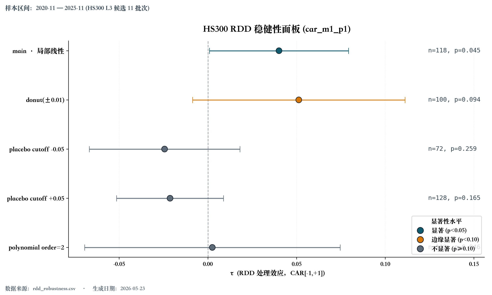
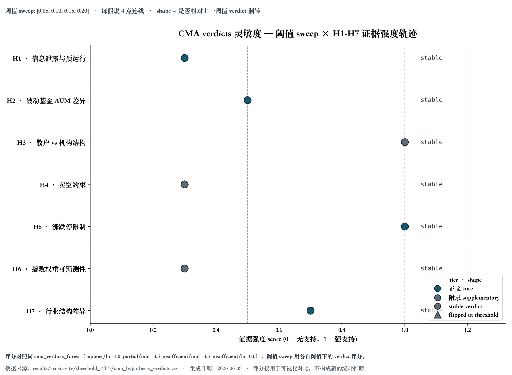
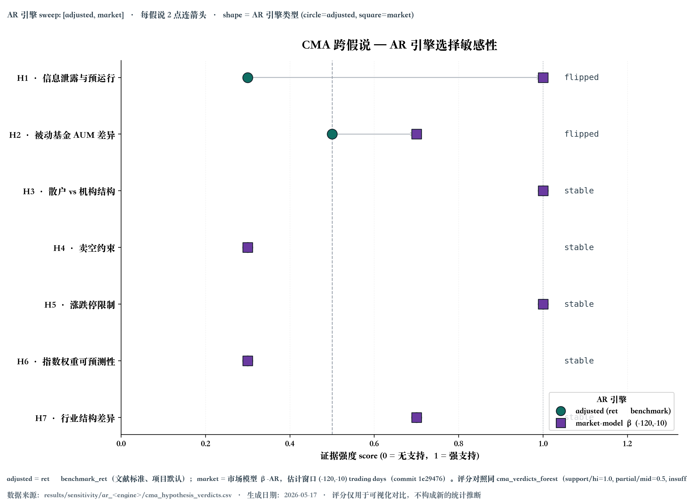
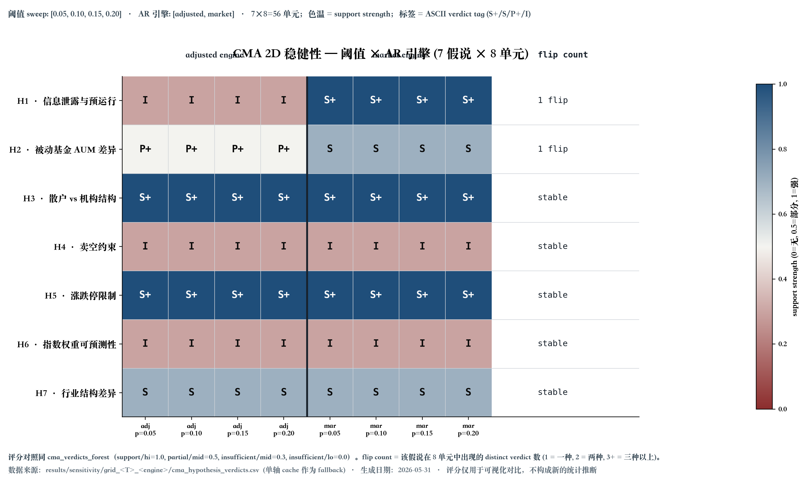

# 指数纳入效应跨市场不对称研究：基于美中市场的实证分析

**作者**: [作者姓名 · 单位 —— 请由作者填写]
**日期**: 2026-05-19
**摘要**: 本文在中美可比框架下考察指数纳入效应，回答指数纳入是否带来超额收益、效应是否会回吐、以及结论是否随市场制度而变三个问题。基于 2010—2025 年沪深 300 与标普 500 的 893 个真实纳入事件，本文采用公告日与生效日双窗口事件研究、匹配回归与沪深 300 断点回归，并以七条跨市场不对称机制假说（样本量 n 介于 4 至 936）解释中美差异。主要发现是：公告日 CAR[-1,+1] 显著为正（中国 +1.76%、美国 +1.84%），但生效日效应在两个市场均不显著；机制上，涨跌停制度（H5）与行业结构（H7）得到支持，沪深 300 断点回归给出 τ=4.01% 的初步识别证据；H6 则在高功效下呈现与假说相反的方向。本文据此指出，纳入溢价主要体现在公告时点，A 股涨跌停制度会截断其价格反应。

## 1. 引言

指数纳入事件是资本市场中一类典型的制度性冲击。当一只股票被纳入沪深 300、标普 500 等重要宽基指数时，市场常在公告日或生效日前后观察到其股价出现显著的短期上涨。这一现象之所以长期受到关注，是因为它提供了一个相对干净的"准自然实验"：被纳入这件事本身并不直接改变公司的现金流或基本面，因此股价的反应可以被用来识别若干纯粹的市场机制——一是跟踪指数的指数基金与 ETF 因跟踪误差约束而产生的机械性买入需求；二是股票进入指数后市场关注度、分析师覆盖与流动性的提升；三是投资者将"被纳入指数"解读为公司代表性、规模地位或质量获得认可的信息背书。这三类机制并不互相排斥，但它们对价格反应的"时点"与"持续性"有不同的预测：信息效应应当在公告日附近就被定价，被动需求冲击则更集中于生效日前后的调仓窗口，而短期交易压力所推动的上涨在压力释放后往往会部分回吐。

本文以中国 A 股（沪深 300）与美国股票市场（标普 500）的指数纳入事件为研究对象，构建公告日与生效日双事件窗口，采用市场调整收益法、匹配对照组方法、机制回归以及沪深 300 断点回归（RDD）扩展，在同一可比框架下考察指数纳入是否带来显著超额收益，并进一步检验上述机制在两个市场制度下的表现差异。本文的贡献有三：第一，在统一的事件研究与裁决框架下并行比较中美两个差异显著的市场，而非孤立地研究单一市场；第二，同时区分公告日与生效日，从而把信息效应与被动配置需求冲击在时序上分离；第三，把成交量、换手率、波动率变化以及涨跌停约束、行业结构、指数权重等制度性变量纳入机制检验。需要强调的是，本文同时把那些证据不足或方向与预期相反的检验如实呈现，并对样本量受限的假说附上后验统计功效分析，使读者能够区分"机制确实不成立"与"本研究的样本不足以检出该机制"。

### 1.1 研究背景

关于股票被纳入重要指数后是否会出现持久的价格上涨，文献的争论可以追溯到 1986 年的两篇奠基性研究。Shleifer（1986）提出，如果股票的需求曲线向下倾斜，那么指数纳入带来的外生需求上升将推高股价，且这一价格变化不必完全回吐——这意味着股票并非彼此完全可替代的资产，指数化冲击可以产生部分持久的影响。几乎同时，Harris 与 Gurel（1986）在标普 500 样本中发现，纳入公告后价格立即上涨逾 3%，但这一上涨在约两周内几乎完全反转，与"短期价格压力"假说一致。两篇文献为后续四十年的研究划定了基本张力：纳入效应究竟是稳定的价格重估，还是会消退的交易压力。

在这两项创世研究之后，文献沿三条线索延伸：从需求曲线与非完全替代角度继续提供正向证据的研究（如 Kaul、Mehrotra 与 Morck 2000，Lynch 与 Mendenhall 1997，Chang、Hong 与 Liskovich 2014）；强调结论高度依赖指数制度、套利约束与识别方法的中性研究（如 Wurgler 与 Zhuravskaya 2002，Madhavan 2003，Petajisto 2011，Ahn 与 Patatoukas 2022）；以及近年指出经典指数效应正在减弱乃至消失的研究（如 Kasch 与 Sarkar 2011，Coakley 等 2022，Greenwood 与 Sammon 2022）。与此同时，中国市场作为一个被动投资发展阶段、交易制度（涨跌停）与投资者结构都与美国显著不同的样本，被 Chu 等（2021）、Yao、Zhou 与 Chen（2022）等研究纳入视野。本文正是在这一从"是否存在"演进到"在何种制度下、通过何种机制存在"的文献脉络中，以中美可比的实证设计参与对话。

### 1.2 研究问题

本文回答 3 个核心问题：

1. 指数纳入后的上涨是不是只是短期交易冲击？
2. 价格效应会不会只部分回吐，从而支持需求曲线向下倾斜？
3. 不同市场制度和识别方法会不会改变结论，尤其是在中国市场？

## 2. 文献综述

本文共索引 16 篇核心文献，并把它们组织成三条研究主线：短期价格压力与效应减弱（price_pressure）、需求曲线与长期保留（demand_curve）、制度识别与中国市场证据（identification）。下文按"反方—中性—正方"三阵营展开争论结构，并在末尾给出本文的定位。完整 author-year 综述见 `docs/literature_review_author_year_cn.md`。

**反方文献：指数效应可能只是短期价格压力，且正在减弱。** 反方文献的核心观点是，指数纳入并不必然带来持久而稳健的价格提升，传统研究观察到的上涨可能更多反映短期交易需求冲击。Harris 与 Gurel（1986）发现标普 500 纳入公告后价格立即上涨逾 3%，但在约两周内几乎完全反转，支持价格压力假说。Kasch 与 Sarkar（2011）发现，在控制纳入前盈利、规模与动量后，标普 500 纳入本身并不带来永久性价值提升。较新的研究进一步支持"效应减弱"：Coakley 等（2022）从期权市场隐含 beta 指出现代市场已将大部分信息提前消化；Greenwood 与 Sammon（2022）更直接提出"消失的指数效应"——标普 500 纳入异常收益从 1980 年代约 3.4% 降到近十年约 0.8%。

**中性文献：效应是否显著取决于制度背景与识别方法。** Madhavan（2003）关于 Russell 重构效应的研究表明，Russell 较强的制度化与可预期性使其价格效应与标普 500 并不相同。Ahn 与 Patatoukas（2022）把重心转向"如何识别指数化的真实影响"，发现指数化对微盘股反而通过放松套利约束提升价格发现速度。Wurgler 与 Zhuravskaya（2002）在机制层面指出，缺乏紧密替代品、套利风险更高的股票在纳入时价格跳得更大。Petajisto（2011）则给出更系统的量化校准并估计被动基金的指数换手隐性成本。中性文献把讨论从"有没有效应"推进到"在什么制度下、用什么方法、通过什么渠道会观察到效应"。

**正方文献：纳入仍会通过需求冲击与非完全替代影响价格。** Shleifer（1986）提出若需求曲线向下倾斜，外生需求上升将推高股价且不必完全回吐。Kaul、Mehrotra 与 Morck（2000）利用 TSE 300 指数权重调整这一更干净的设定，进一步支持需求曲线向下倾斜。Lynch 与 Mendenhall（1997）以及 Denis 等（2003）继续发现纳入带来显著价格反应；Chang、Hong 与 Liskovich（2014）利用 Russell 断点说明指数化具有资产定价意义。Chu 等（2021）把讨论扩展到中国市场，发现 CSI 300 调入与调出股在多年持有期上均有异常收益；Yao、Zhou 与 Chen（2022）用沪深 300 断点回归提供正向证据，并指出中国市场调入效应显著但呈现明显的不对称结构。

**本文定位。** 关于指数纳入效应的争论已从"是否存在"演进为"在什么条件下存在、通过何种机制存在、是否仍像早期那样显著存在"。本文既不预设指数效应必然存在，也不简单接受其已消失的结论，而是在中美可比框架下，借助公告日与生效日双窗口、匹配对照组与七条跨市场不对称机制假说，对这一经典问题给出更细致、并对自身样本局限保持透明的经验证据。本文的 16 篇核心文献分为 3 条研究主线：price_pressure, demand_curve, identification。

## 3. 研究设计

### 3.1 样本与数据

样本期为 2010-01-01 至 2025-12-31。事件样本由两个市场的宽基指数纳入事件构成，共 893 个真实事件：中国市场（沪深 300）274 个事件、涉及 233 只股票，美国市场（标普 500）619 个事件、涉及 512 只股票。中国事件清单来自中证指数公司官方调整公告 PDF，并以公开新闻补充转录；美国事件清单来自维基百科标普 500 成分股表与 S&P Dow Jones 官方脚注。增发、分拆事件以及 ticker 变更等纯技术性调整不纳入样本；对短期内重复纳入的事件做去重并标记冲突。价格、收益、成交量数据来自 Yahoo Finance（yfinance）日频 OHLCV；市值与换手率为近似口径，基准收益中国用 CSI300、美国用标普 500。被动基金 AUM 美国用 Federal Reserve Z.1 年度序列（12 个观测），中国用自建 ETF TNA 聚合 proxy（5 个年终快照）。沪深 300 RDD 使用 L3 官方候选边界样本（2020-11 至 2025-11，11 个批次，356 行）。匹配以行业×同期市值分位为口径，协变量平衡门禁要求 |SMD|<0.25。这些数据口径均为近似而非交易所历史精确口径，其边界详见本文 §5 与 `docs/limitations.md`；本文据此把研究定位为机制分析与课程层面的实证研究，而非顶刊级因果推断。七条跨市场不对称机制假说所用的事件级样本量如下：

- **H1 (信息泄露与预运行)**：n = 436 (core)
- **H2 (被动基金 AUM 差异)**：n = 17 (core)
- **H3 (散户 vs 机构结构)**：n = 4 (supplementary)
- **H4 (卖空约束)**：n = 436 (supplementary)
- **H5 (涨跌停限制)**：n = 936 (core)
- **H6 (指数权重可预测性)**：n = 67 (supplementary)
- **H7 (行业结构差异)**：n = 187 (core)
数据来源 + 限制详见本文 §5 与 `docs/limitations.md`。

### 3.2 实证方法

本文的实证策略由三层构成，相互印证而非彼此替代。

**(1) 事件研究。** 以公告日和生效日分别作为事件时点，构建 [-20,+20] 交易日窗口，采用市场调整收益法计算异常收益 AR(i,t) = R(i,t) − R(m,t)，累计异常收益 CAR(i,[τ1,τ2]) = Σ AR(i,t)。本文重点报告 CAR[-1,+1]、CAR[-3,+3]、CAR[-5,+5]，并以 CAR[-1,+1] 为主窗。AR 计算默认采用简单市场调整引擎（ar = ret − benchmark_ret），主表、PAP 与全部裁决均钉在这一引擎上；另提供带 β 估计的市场模型 AR（估计窗口默认 (-120,-10)）作为稳健性引擎。显著性检验默认用简单 t 检验，并辅以 Patell (1976) Z 与 BMP (1991) t。需要说明的是，本文 σ 由面板内 [-window_pre,-2] 区间估计（约 18 个交易日），短于文献标准的 120–250 日窗口，影响见 §5。

**(2) 匹配回归。** 在事件研究之外，本文构造匹配对照面板（212,756 行，按 Stuart 2010 标准化均值差匹配），以 CAR(i) = α + β·Inclusion(i) + γ1·Size(i) + γ2·PreReturn(i) + ε(i) 为主回归。机制层面的七条跨市场不对称假说（H1–H7）由 CMA 编排统一裁决，决定阈值为 p<0.10（"部分支持"边界）与 p<0.05（"支持"边界），输出层附 Bonferroni 与 Benjamini-Hochberg q-value；Bootstrap 检验采用按公告日分块的 block bootstrap（5000 次迭代）。

**(3) 沪深 300 断点回归（RDD）。** 利用沪深 300 样本调整名单的官方排序，在 cutoff = 300 处构造局部线性断点回归（带宽自动取 0.06），辅以 donut hole、placebo cutoff、二次多项式三类稳健性。当前 L3 覆盖期仅 5 年（11 个批次），尚不足以支撑论文级强因果声明，RDD 结果定位为初步识别证据。

需在方法层面预先澄清：本文 §4.1 的主结论（公告日 CAR 显著正向）由事件研究直接给出，而 H1–H7 七条机制假说回答的是"为什么中美两个市场的反应不一致"，并不是回答"是否存在超额收益"本身——这一区分在 §4 与 §6 中将反复强调。

### 3.3 七条跨市场不对称机制假说

下表自动汇总自 `results/real_tables/cma_hypothesis_verdicts.csv`，列出 H1-H7 名称、当前裁决、置信度、证据层级 (core/supplementary) 与样本量。

| 假说 | 名称 | 裁决 | 置信度 | 证据层级 | n | 头条指标 | 主线 |
|---|---|---|---|---|---:|---|---|
| H1 | 信息泄露与预运行 | 证据不足 | 中 | core | 436 | bootstrap p = 0.8748 | identification |
| H2 | 被动基金 AUM 差异 | 部分支持 | 中 | core | 17 | US AUM ratio = 13.48 | demand_curve |
| H3 | 散户 vs 机构结构 | 支持 | 高 | supplementary | 4 | 双通道命中率 = 0.75 | price_pressure |
| H4 | 卖空约束 | 证据不足 | 中 | supplementary | 436 | regression p = 0.5366 | identification |
| H5 | 涨跌停限制 | 支持 | 高 | core | 936 | limit_coef p = 0.00824 | identification |
| H6 | 指数权重可预测性 | 证据不足 | 中 | supplementary | 67 | heavy−light spread = -0.01903 | demand_curve |
| H7 | 行业结构差异 | 支持 | 中 | core | 187 | US sector spread = 5.954 | identification |

## 4. 实证结果

### 4.1 主结果


> 图 1 说明：H1-H7 在 y 轴，support-strength 评分（0-1）在 x 轴。颜色按 `evidence_tier`（core / supplementary），右侧 monospace 列为 `n | tier | verdict/conf`。当前裁决分布：3 条证据不足、1 条部分支持、3 条支持。重绘命令：`index-inclusion-build-cma-verdicts-forest`。

本文的核心事件研究结果是清晰的：指数纳入在公告日附近带来显著的正向超额收益，但在生效日附近并不显著。中国市场公告日 CAR[-1,+1] 均值为 +1.76%（t=4.93，p<1e-5，n=117），美国市场为 +1.84%（t=5.25，p<1e-6，n=254），两个市场均高度显著且方向一致；与此相对，生效日 CAR[-1,+1] 在中国为 +0.42%（t=0.93，p=0.36）、在美国为 -0.14%（t=-0.51，p=0.61），均不显著。这一"公告日强、生效日弱"的格局与信息背书效应在公告时点即被定价的解读相一致，也意味着生效日的被动调仓需求要么被市场提前预期与吸收，要么不足以在主窗口内推动可识别的额外上涨。

在这一主结论之外，七条跨市场不对称机制假说回答的是"为什么中美反应不完全一致"。图 1 汇总了七条假说的当前裁决：3 条得到**支持**（H3、H5、H7），1 条**部分支持**（H2），3 条**证据不足**（H1、H4、H6）。按证据强度分层，4 条为 core（H1、H2、H5、H7，样本量较充足，进入正文），3 条为 supplementary（H3、H4、H6，样本受限或方向矛盾，置于附录与稳健性讨论）。需要特别说明的是，"core/supplementary"是关于**样本量是否充足**的分层，而非关于**裁决是否为支持**的分层：H3 虽然裁决为"支持"，但 n 仅为 4，因此归入 supplementary；H1 虽然裁决为"证据不足"，但 n=436，因此仍在 core。下文 §4.2 逐条展开，并对低 n 假说在 §5.1 附后验功效分析。

### 4.2 跨市场不对称机制

#### H1：信息泄露与预运行 (证据不足 · core)

- 当前裁决：**证据不足** (置信度 中)
- 样本量：n = 436
- 头条指标：bootstrap p = 0.8748
- 研究主线：identification

H1 检验的机制是信息泄露与预运行：如果某个市场的纳入信息在公告前更易泄露，那么该市场的"预运行"（pre-announce runup，即公告前的累计异常收益）应当系统性更高。本文以中美两个市场的 pre-runup 差异为统计量，并用按公告日分块的 block bootstrap（5000 次）评估其显著性。结果显示，中国 pre-runup 均值为 3.09%、美国为 2.59%，差异仅 0.50%；该差异在 bootstrap 下不显著（p=0.875，95% CI=[-3.25%, 4.70%]）。因此裁决为**证据不足**。这里"证据不足"是一个谨慎而非否定的结论：方向上中国略高，但跨市场的 pre-runup 差异本身可能由多种因素（公告与生效之间的间隔长度、行业与规模构成、市场整体波动）共同驱动，无法被干净地归因为"信息泄露"。换言之，本研究缺少的是能够把信息泄露从其他混杂因素中剥离出来的识别变量（如分析师覆盖、知情交易代理指标），而非缺少样本量——H1 的事件级样本 n=436 在 core 层级。值得提示的是，H1 的裁决对 AR 引擎敏感（见 §4.4.2）：在市场模型引擎下该差异会变得显著，这一脆弱性必须与本结论一并阅读，详见 §5。

#### H2：被动基金 AUM 差异 (部分支持 · core)

- 当前裁决：**部分支持** (置信度 中)
- 样本量：n = 17
- 头条指标：US AUM ratio = 13.48
- 研究主线：demand_curve

H2 检验的机制是被动基金 AUM 差异：若被动指数资金规模越大、其对成分股的"机械性买入"越强，则需求曲线效应应当越明显——但同时，被动资金充分预期纳入名单后，生效日的"惊喜成分"会被提前定价，从而使生效日 CAR 随被动 AUM 上升而走弱。本文以两个市场被动 AUM 序列的首尾趋势，与各自 effective-day rolling CAR 的方向一致性为判据。结果显示，中国方向符合 H2：被动 AUM 由 0.19 升至 1.12（CNY trillion，2020→2024），同期 effective CAR 由 0.59% 降至 0.42%（2021→2025）；美国 effective CAR 则没有持续衰减（0.04%→0.05%，2014→2025），方向偏中性。由于一个市场方向符合、另一个市场方向不明确，裁决为**部分支持**。它之所以不是"支持"，是因为两个市场尚未给出一致证据，且中国端的被动 AUM 是 ETF TNA 聚合 proxy 而非基金业协会口径的官方"被动 AUM"，ETF 宇宙逐年扩张会使早年快照天然低估真实跟踪规模；它之所以不是"证据不足"，是因为合并样本 n=17（美国 rolling 12 + 中国 rolling 5）已越过证据分层的 promotion floor（15），且中国端首尾方向确实与机制预测一致。后验功效分析（§5.1）提示，H2 单市场 n=15 的趋势检验功效偏低，因此本文把 H2 的证据强度严格表述为"方向性参考"，并在 §5 披露 proxy 局限。H2 的裁决同样对 AR 引擎敏感（见 §4.4.2）。

#### H3：散户 vs 机构结构 (支持 · supplementary)

- 当前裁决：**支持** (置信度 高)
- 样本量：n = 4
- 头条指标：双通道命中率 = 0.75
- 研究主线：price_pressure

H3 检验的机制是散户与机构投资者结构差异：若指数纳入伴随真实的量能集中，则成交量与换手率两条通道应同时出现显著反应。本文在 CN/US × announce/effective 四个象限上，分别检验处理组对换手率变化与成交量变化的回归系数，并以"双通道均 p<0.10"为命中判据。结果显示，4 个象限中有 3 个通过双通道判据（中国公告日、中国生效日、美国公告日均双通道显著；仅美国生效日只有换手率通道显著、成交量通道不显著），命中率为 0.75，达到"支持"阈值，故裁决为**支持**。然而，必须把这条"支持"读作 supplementary 级别的支持：其样本只有 4 个象限（n=4）。§5.1 的后验功效分析明确指出，在 n=4、α=0.05 下，即便真实命中率确实为 75%，本研究检出它的统计功效也仅约 0.13（精确二项检验下甚至不存在拒绝域）。因此 H3 的"支持"应被理解为方向性、描述性的证据，而不是高功效检验下的稳健结论——这正是 H3 被归入 supplementary 的统计学依据。要把 H3 升级为正文级证据，需要的不是更换检验，而是把象限拆得更细（例如叠加波动率通道或 sector 异质性）以扩大有效样本。

#### H4：卖空约束 (证据不足 · supplementary)

- 当前裁决：**证据不足** (置信度 中)
- 样本量：n = 436
- 头条指标：regression p = 0.5366
- 研究主线：identification

H4 检验的机制是卖空约束：若一个市场的卖空约束更强、套利更难，则纳入引发的价格偏离更难被反向套利纠正，公告与生效之间的"空窗期漂移"（gap_drift）应当系统性更高。本文以事件级回归检验 CN-US gap_drift 差异，并控制空窗期长度（gap_length_days）。结果显示，中国 gap_drift 为 0.76%、美国为 -0.33%，控制空窗期长度后中国虚拟变量的系数为 0.61%，但不显著（p=0.537，n=436）。因此裁决为**证据不足**。这里要特别强调一个诚实的读法：n=436 看似充足，但观测系数（0.0061）只有其标准误（0.0099）的约 0.6 倍，离 α=0.05 的显著性很远。§5.1 的后验功效分析显示，在当前观测效应规模下 H4 的功效仅约 0.09——也就是说，即便 H4 所设想的卖空约束效应真实存在且规模等于当前观测值，本研究也几乎无法把它与零区分开。要在 80% 功效下稳健检出这一规模的效应，所需系数约为观测值的 4.5 倍，或样本量需扩大约 20 倍（n≈9000）。因此，H4 的"证据不足"**不构成对卖空约束机制的反证**，只表示在现有样本与口径下证据不足以拒绝原假设；本文据此把 H4 保留为 supplementary。

#### H5：涨跌停限制 (支持 · core)

- 当前裁决：**支持** (置信度 高)
- 样本量：n = 936
- 头条指标：limit_coef p = 0.00824
- 研究主线：identification

H5 检验的机制是涨跌停限制：中国 A 股设有每日涨跌停板，当纳入引发的买压在公告日把股价顶到涨停时，当日价格反应会被人为截断、部分上涨被推迟到后续交易日，从而使涨跌停暴露成为公告日 CAR 的一个可预测因素。本文以中国事件级回归检验涨跌停命中率对公告日 CAR 的预测力。结果显示，涨跌停命中率正向且显著地预测公告日 CAR（limit_coef=0.1549，SE=0.0586，t=2.64，p=0.008，R²=0.011，n=936），符合 H5 的截断机制，故裁决为**支持**。在三个 core 假说中，H5 是样本量最大、最稳健的一条：它在 frequentist 意义上显著（p=0.008<0.05），方向与机制预测一致，且其裁决不随 p-value 阈值变化（见 §4.4.1）。但本文也按 §5.1 的功效分析如实标注一处边界：在 n=936 下，H5 观测效应对应的后验功效约为 0.75，恰好落在 80% 阈值之下，观测系数（0.1549）几乎等于 80% 功效所需的最小可检测系数（约 0.164）。这意味着，H5 是一条可靠的 supportive 证据，但读者不应把它误读为"压倒性证据"——若样本中的极端观测稍有抖动、真实系数略低于观测值，该效应就可能滑入难以识别的区间。综合而言，H5 是本文对"中美反应不一致"给出的最强机制解释之一：涨跌停制度是中国市场特有的、可被直接度量的截断渠道。

#### H6：指数权重可预测性 (证据不足 · supplementary)

- 当前裁决：**证据不足** (置信度 中)
- 样本量：n = 67
- 头条指标：heavy−light spread = -0.01903
- 研究主线：demand_curve

H6 检验的机制是指数权重可预测性：被纳入指数后权重越高的股票，理论上吸引的被动机械买入越多，因此其公告日跳涨（announce_jump）应当系统性更强。本文以匹配后的中国事件样本（n=67）按权重代理变量的中位数切为重权重与轻权重两组，比较其 announce_jump。结果与 H6 的预测**方向相反**：重权重组的 announce_jump 中位数为 +1.29%，反而**低于**轻权重组的 +3.20%，重减轻的差值为 -1.90%。这一负向不仅出现在分组中位数比较中，也在多个稳健性规格中一致复现：四分位 Q4−Q1 跳涨差为 -2.79%（p=0.031），标准化权重的 OLS-HC3 系数为 -0.0061（p=0.001），中位数分位数回归系数为 -0.0057（p=0.312），置换检验下的 Q4−Q1 差为 -2.79%（p=0.027）；五个有效规格全部为负、无一为正。因此裁决为**证据不足**（指 H6 所设想的"权重越高跳涨越强"不被支持）。

H6 是一条需要审慎措辞的假说，原因在于：这里的"证据不足"**不是因为样本太小，而是因为方向与假说相反**。§5.1 的后验功效分析明确指出，在 n=67、观测 Cohen's d≈-0.73 下，本检验的功效约为 1.00——样本量完全足以检出这一规模的效应。换言之，数据给出的不是"无法判断"，而是一个统计上稳健、但方向与 H6 直觉相反的信号：在本文的中国样本中，权重更高的纳入股票公告日跳涨反而更小。一个可能的、需要作者进一步检验的解释是，高权重股往往是大市值蓝筹，其被纳入更易被市场提前预期、定价更充分，因而公告日的"惊喜"反而更小；但这只是事后的机制猜想，本文不据此把 H6 改写为一条新的支持性假说。诚实的处理是：H6 保留在 supplementary，裁决文字明确表述为"对 H6 原方向的反证"，而非"样本不足、无法判断"。其中加入行业固定效应后系数变为 -0.0436 但 p 接近 1（R²=0.443），这更像高杠杆/吸收变异的诊断规格，不应单独当作强证据，本文不以此规格作结论。

#### H7：行业结构差异 (支持 · core)

- 当前裁决：**支持** (置信度 中)
- 样本量：n = 187
- 头条指标：US sector spread = 5.954
- 研究主线：identification

H7 检验的机制是行业结构差异：纳入效应的强弱可能在不同行业之间系统性不同，因此两个市场的行业构成差异会成为跨市场反应不一致的一个来源。本文以美国 8 个合格行业之间不对称指数（asymmetry_index）的跨行业极差（max−min）为判据。结果显示，美国行业间极差为 5.95（最高为 Materials 的 +3.90，最低为 Real Estate 的 -2.05），极差跨越 0 且超过判据阈值（≥4.0），表明行业结构在纳入效应中确实起作用，故裁决为**支持**。这一结论有补充稳健性支撑：在 sector×phase/treatment 交互回归中，美国样本的联合显著性 p=0.064（n=1924），最显著项为 effective_x_sector_Industrials，方向上增强了 H7 的机制解释。H7 归入 core（行业极差 n=187，交互回归 n≈1924），其裁决不随 p-value 阈值变化。H7 的置信度被标注为"中"而非"高"，原因在于两个口径上的保留：其一，中国与美国当前使用不同的行业分类体系（中国 35 个行业、美国 11 个），尚未统一到同一 sector taxonomy，因此 H7 的强证据主要来自美国市场，跨市场可比性有限；其二，行业极差是一个描述性的离散度指标，本身不构成因果识别。要把 H7 升级为"高"置信度，下一步应统一中美行业分类并补置换检验。综合而言，H7 表明行业结构是理解纳入效应横截面差异的一个有意义的维度，但目前仍以美国市场内的证据为主。


### 4.3 HS300 RDD 结果

HS300 主结果（局部线性 RDD）：

- τ = **4.01%**
- p = 0.0450
- n = 118（断点左侧 42 / 右侧 76）
- outcome = `car_m1_p1`
- bandwidth = 0.06
- 稳健性 spec 数：5



> 图 2 说明：HS300 RDD `car_m1_p1` outcome 在 main / donut / placebo±0.05 / polynomial 共 5 个 spec 下的 τ 估计与置信区间。完整数值见 `results/literature/hs300_rdd/rdd_robustness.csv`。

为在制度识别层面补强结论，本文利用沪深 300 样本调整名单的官方排序，在 cutoff = 300 处构造局部线性断点回归。头条估计为公告日 CAR[-1,+1] 在断点右侧（被纳入）相对左侧的跳跃 τ=4.01%（p=0.045，n=118，带宽 0.06），方向与事件研究一致——位于纳入门槛刚好之上的股票，其公告日 CAR 显著高于刚好之下的对照股票。这与 §4.1 公告日效应显著的主结论相互印证。

但本文如实报告全套稳健性面板。在 donut hole（剔除断点 ±0.01 的观测）下，样本缩至 102 行，τ=4.93% 但落到 marginal 显著（p=0.102）；两个 placebo cutoff（±0.05）的 τ 分别为 -2.44%（p=0.259）与 -1.98%（p=0.184），均不显著且接近 0——这正是 placebo 检验应有的表现，说明 main spec 的跳跃并非伪断点。然而，二次多项式规格几乎吸收了断点跳跃（τ=0.37%，p=0.921），表明 main 估计对函数形式设定较为敏感。综合来看，五个规格中 main 边界显著、placebo 行为正确，但 donut 仅 marginal、polynomial 不显著，断点结果对设定确有敏感性。

更根本的限制在数据覆盖：当前 L3 官方候选边界样本仅覆盖 2020-11 至 2025-11、共 11 个批次（约 5 年），远短于断点回归识别因果效应通常要求的 10 年以上窗口；同时本文尚未补做 McCrary 操纵性检验。因此，本文把沪深 300 RDD 结果明确定位为**初步识别证据**，与事件研究、匹配回归一同呈现以增强方向一致性，但不单独作为主表的因果结论。要把 RDD 升级为论文级强因果声明，需要把 L3 覆盖扩展到 ≥10 年（约 20 个批次）并补操纵性检验，相关审计见 `docs/hs300_rdd_l3_collection_audit.md`。

### 4.4 稳健性检查

#### 4.4.1 阈值敏感性



> 图 3 说明：在 4 个 p-value 阈值（0.05, 0.1, 0.15, 0.2）下重跑 CMA 编排，比较 7 条假说的裁决稳定性。共 4 cell，7 假说稳定，0 假说在阈值轴上 flip。

结论 (auto-derived)：在 0.05-0.1-0.15-0.2 阈值范围内，7 / 7 条假说裁决稳定；**全部 7 条假说裁决不随 p-value 阈值变化**，说明阈值选择不是核心机制。

#### 4.4.2 AR 引擎敏感性



> 图 4 说明：在 adjusted / market 共 2 个 AR 引擎下重跑 CMA，比较裁决稳定性。5 假说稳定，2 假说 flip。

结论 (auto-derived)：在 AR 引擎切换（adjusted ↔ market）下，5 / 7 条假说裁决稳定；2 条假说裁决发生 flip：**H1**, **H2**。论文中必须将这一脆弱性写进 §5 限制。

#### 4.4.3 联合稳健性



> 图 5 说明：阈值 × AR 引擎 2D 网格共 8 cell，比较 7 条假说在全 cell 下的裁决一致性。5 假说稳定，2 假说 flip。

结论 (auto-derived)：在 2D 联合稳健性（共 8 cell）下，5 条假说全 cell 稳定，2 条假说在 2D 网格内 flip：**H1**, **H2**（与 AR 引擎轴 flip 集合一致——脆弱性来自 AR 引擎而非阈值）。

## 5. 限制与讨论

本节在 `docs/limitations.md` 所列数据与方法约束之外，补充三点论文层面的讨论，并以此界定本文结论的适用边界。

**(1) 数据口径的近似性与本文的研究定位。** 本文的价格与市值数据来自 Yahoo Finance：市值由当前流通股数与历史价格近似得到，并不等价于交易所历史自由流通市值；换手率以成交量除以流通股数近似，未过滤大宗与协议交易；中国端被动 AUM 是 ETF TNA 聚合 proxy 而非基金业协会口径的官方"被动 AUM"，且单位为 CNY trillion、与美国行的 USD trillion 不可跨币种直接比较绝对值。这些近似不会污染本文的核心结论（事件研究主结果用的是收益与基准收益，裁决用的是市场内方向趋势），但它们决定了本文的研究定位：本文适合作为机制分析与课程层面的实证研究，而**不宜**被当作可直接进入顶级期刊的强因果证据。任何引用本文结果的场合，都应同时引用本节与 `docs/limitations.md`。

**(2) AR 引擎敏感性与 H1/H2 的脆弱性。** 本文的主表、裁决基线快照与全部裁决均钉在简单市场调整 AR 引擎（ret − benchmark_ret）上。但 §4.4.2 与 §4.4.3 的稳健性检查显示，7 条假说中有 2 条（H1 与 H2）的裁决在切换到带 β 估计的市场模型 AR 引擎时会发生翻转。具体而言，后验功效表显示，H1 在 adjusted 引擎下 pre-runup 差异为 +0.50%、bootstrap p=0.875（证据不足），而在 market 引擎下差异放大到 +2.06%、bootstrap p=0.0004（转为显著）；H2 的 Cohen's d 也在两引擎间从 -0.04 变到 -0.37。这意味着 H1/H2 的裁决并非稳健结论，而是对异常收益模型设定敏感的"边界裁决"。本文如实把这一脆弱性写入正文：H1 与 H2 的结论应被读作"在默认 AR 引擎下成立、但对模型设定敏感"，读者在引用时不应忽略这一条件。相比之下，H5、H7 等核心结论以及阈值轴（4 个 p 阈值下 7/7 稳定）的稳健性不受 AR 引擎影响，可信度更高。

**(3) 裁决口径与 post-hoc 性质。** 本文 7 条机制假说 H1–H7 是 **post-hoc、探索性**的：它们在观察到 announce-vs-effective、CN-vs-US 的不对称结果**之后**才形成，本项目**没有预分析计划 (pre-analysis plan)**，7 条裁决**不是 confirmatory 验证**。裁决阈值（p<0.10、内阈值 0.05）是在已知结果的情况下选定的分析参数，没有事前承诺。多重检验校正（Bonferroni、Benjamini-Hochberg q-value）虽已在输出层报告，但同样是在假说选定之后应用的。这一探索性性质的完整披露见 §7；7 假说的判据与样本边界记录在 `docs/analysis_parameters.md`（透明性文档，非 pre-analysis plan）。低 n 假说的后验功效见 §5.1。

### 5.1 低-n 假说后验统计功效

| 假说 | n | 测试族 | 在观测效应下的功效 | 80% 功效下的 MDE | 解读 |
|---|---:|---|---:|---:|---|
| H3 | 4 | binomial_proportion_z_two_sided | 0.134 | 0.499 | normal-approx power=0.134 · exact-binomial power=0.000 · posterior P(p>0.60|data)=0.663 (Beta(1,1) uniform prior). MDE@80%=+0.499 概率差（p1≈0.999）。严重欠功效 (power=0.13 < 0.30): n=4 无法在 α=0.05 检出真实命中率 75%；结果按 supplementary 处理是合理的。 |
| H6 | 67 | one_sample_t_two_sided | 1.000 | 0.347 | Cohen's d (observed) ≈ -0.728 (bucket-SD=0.0319); two-sided t-test power=1.000. 对比小/中/大效应 (d=0.2/0.5/0.8) 的功效 = 0.36 / 0.98 / 1.00. MDE@80% = |d|=0.347. 功效充足 (power=1.00 >= 0.80) — n 足以检出该效应，但观测方向 (heavy<light) 与 H6 预测 (heavy>light) 相反，所以 verdict='证据不足' 并不是 n 不够，而是方向不符。 |

完整 CSV + markdown twin 见 `results/real_tables/power_analysis_report.{csv,md}`；方法学与可重现命令见 `docs/limitations.md` §7 与 `docs/cli_reference.md` §25。

下文为 `docs/limitations.md` 的自动嵌入，便于审稿人无须翻附录直接阅读：

---

# 数据与方法限制

本文档集中记录项目的关键数据近似与方法约束，论文写作和读者评估时请同时引用此页。

## 1. 价格与市值数据

- **价格 / 收益**：Yahoo Finance（yfinance）日频 OHLCV；按当前交易日复权。
- **市值（mkt_cap）**：用 Yahoo `sharesOutstanding`（当前值）× 历史价格近似得到。
  **不等价于交易所历史自由流通市值**，仅适合机制分析与课程汇报。
- **换手率（turnover）**：volume / shares_outstanding 近似，没有过滤大宗 / 协议交易。
- **基准（benchmark_ret）**：CN 用 CSI300 指数收益，US 用 S&P 500 指数收益（`benchmarks.csv`）。

## 2. 事件清单

- **CN 事件**：中证指数公司官方调整公告 PDF + 公开新闻补充转录（`source` 列记录来源）。
- **US 事件**：维基百科 S&P 500 成分股表 + S&P Dow Jones 官方脚注。
- **未覆盖**：增发 / 分拆事件、内部技术性调整（如 ticker 变更）。
- **样本规模**：893 个真实事件（274 CN + 619 US，2010-2025）。

## 3. 被动 AUM（H2 假说）

- **US 来源**：Federal Reserve Z.1 系列（`BOGZ1FL564090005A`，US ETF Total Financial Assets）。
  12 个年度观测（2010-2025），按 USD trillion 计。
- **CN 来源**：自建 ETF TNA 聚合 proxy，存于 `data/raw/cn_passive_aum_proxy.csv`。
  方法：年终（12-31 或最近交易日）抓取 CSI300 / CSI500 跟踪 ETF 的份额×单位净值
  (akshare `fund_etf_scale_sse` + `fund_scale_daily_szse` + `fund_etf_fund_info_em`
  with `fund_etf_hist_em` 收盘价作 NAV 兜底)，按指数汇总后再相加。
  生成命令：`uv run index-inclusion-download-cn-passive-aum-proxy`。
- **CN 数据局限（必须在论文中披露）**：
  - 这是 **TNA 聚合 proxy**，不是基金业协会披露的官方“被动 AUM”口径；
  - ETF 宇宙逐年扩张（2024 年下半年是机构 ETF 配置爆发期），早年快照天然
    低估真实被动跟踪 AUM；
  - n=5 个年终快照（2020-2024），仍少于 US 的 12 个，但 H2 verdict 已升级为
    "core" 因为合并 n（CN rolling CAR 5 + US rolling CAR 12 = 17）越过 `EVIDENCE_TIER_PROMOTION_FLOOR["H2"]=15` 阈值；
  - 数据新鲜度依赖 akshare（东方财富 / 上交所 / 深交所）公开接口，刷新周期由
    `download_cn_passive_aum_proxy` 控制；
  - 单位是 CNY trillion，而 US 行是 USD trillion，**不能跨币种直接比较绝对值**。
    H2 verdict 只用市场内首尾趋势方向，所以币种不一致不污染裁决结果。
- **保留的另一份 CN 数据**：`data/raw/passive_aum.csv` 仍保留 top-down `download_passive_aum_cn`
  写入的 CN 行（公募基金总规模 × 指数型占比），但 CMA 编排时被 proxy 覆盖。
  如果未来要回退到旧口径，删除 `data/raw/cn_passive_aum_proxy.csv` 即可。

## 4. HS300 RDD 数据层级

- **L3（官方）**：2020-11 到 2025-11 共 11 个批次，356 行（含 191 调入 + 165 备选对照）。详见 `docs/hs300_rdd_data_contract.md`。
- **L2（公开重建）**：1887 行；从公开调整新闻反推，**不等价于中证官方历史排名**。
- **L1（演示）**：合成数据，仅供 pipeline 测试。
- **当前主表使用**：默认 L3；缺失时返回 `missing` 状态而非自动降级。
- **若要支持论文级因果声明**：需扩展 L3 到 ≥10 年并补 McCrary 操纵性检验，
  详见 `docs/hs300_rdd_l3_collection_audit.md`。

## 5. 事件研究方法

- **AR 计算**：默认仍为简单市场调整（`ar = ret − benchmark_ret`，向后兼容；
  主表与 CMA verdict 都钉在这一引擎上）。通过
  `index-inclusion-run-event-study --ar-model market` 可切换到带 β 估计的市场模型 AR
  （`ar_market_model = ret − (α + β·benchmark_ret)`，估计窗口默认 (-120, -10)，
  与短窗口事件研究文献一致；用 `--estimation-window LOW,HIGH` 改写）。切换引擎
  在 CN 样本上经验上会让 CAR 偏移约 5-15 bps（β 与 1 之差带来的修正），主表
  保持不变；若要把另一引擎纳入论文，应在 `docs/analysis_parameters.md` 的变更日志中记录这次口径变更。
- **σ 估计**：默认从 panel 内 `[-window_pre, -2]` 区间估计 (window_pre 默认 20)；
  这是 18 日的 in-panel proxy estimation window，比文献标准（120-250 日）短。
- **标准化**：`compute_patell_bmp_summary` 在简单 t 之外提供 Patell t 与 BMP t；
  在样本量充足时建议优先看 BMP（不假设零相关）。
- **长窗口** `[0,+120]`：样本会大幅缩水，仅作探索性结果，不进入主表。

## 6. 多重检验与 post-hoc 披露

- **当前阈值**：决定层 p<0.10（默认）；输出层附 Bonferroni 与 Benjamini-Hochberg q-value。
- **H1–H7 是 post-hoc、探索性假说**：本项目 **没有预分析计划 (pre-analysis plan)**。
  7 条 CMA 假说是在观察到 announce-vs-effective、CN-vs-US 的不对称结果**之后**形成的，
  属于探索性解释，**不是 confirmatory 验证**。裁决阈值（p<0.10、内阈值 0.05）是在
  已知结果的情况下选定的分析参数，没有事前承诺。多重检验校正
  （Bonferroni、Benjamini-Hochberg）虽已在 `cma_hypothesis_verdicts.csv` 中报告，
  但同样是在假说选定**之后**应用的。因此论文与汇报中引用 H1–H7 时，应明确表述为
  post-hoc 探索性证据，并优先只把 `evidence_tier=core` 的假说放进主表。
- **分析参数记录**：7 假说的判据、阈值与样本边界集中记录在
  [`docs/analysis_parameters.md`](analysis_parameters.md)——这是一份透明性文档，
  **不是 pre-analysis plan**。verdict 跨时间稳定性可用 `index-inclusion-verdict-summary
  --vs-pap` 对比裁决基线快照查看；详细 verdict 迭代流程见
  [`docs/verdict_iteration.md`](verdict_iteration.md)。

## 7. 每假说的统计功效（post-hoc）

`index-inclusion-power-analysis` 会对低-n 假说做后验功效计算并把结果落到
`results/real_tables/power_analysis_report.csv` 与 `power_analysis_report.md`。
α=0.05、target power=80%，对当前主裁 H3 / H6 的结论是：

| 假说 | n | 观测效应 | 在观测效应下的功效 | 80% 功效下的 MDE | 解读 |
|---|---:|---:|---:|---:|---|
| H3 (双通道命中率) | 4 | hit_rate=0.75（差值 +0.25） | ≈ 0.13（normal-approx）/ 0.00（exact） | 概率差 ≈ +0.50（即 p1≈1.0） | 严重欠功效；exact-binomial 在 α=0.05 下不存在 rejection region。结果按 supplementary 处理是合理的。Bayesian P(p>0.60 \| 3/4, Beta(1,1) 先验) ≈ 0.66 — 给方向性参考。 |
| H6 (heavy−light spread) | 67 | Cohen's d ≈ −0.73（pooled SD≈0.032） | ≈ 1.00 | \|d\| ≈ 0.35 | 功效充足，n=67 足以检出该规模效应，但观测方向 (heavy<light) 与 H6 预测 (heavy>light) 相反 → "证据不足" 来自方向不符，**不是** n 太小。 |

- **方法学**：H3 使用一比例 z-test（正态近似）+ exact-binomial 对照；H6 使用单样本 t-test，Cohen's d = mean/pooled-SD；MDE 由二分搜索求解。
- **数据源**：H6 的 pooled SD 由 `data/processed/hs300_weight_change.csv` × `results/real_tables/cma_gap_event_level.csv` 按 weight_proxy 中位数切重/轻 bucket 重算（n_heavy=34，n_light=33）；面板缺失时回退到 H6 OLS-HC3 r²=0.033 反推的 \|d\|≈0.18，并在 interpretation 里明文说明。
- **可重现**：`index-inclusion-power-analysis` 是 48 个 console scripts 的第 48 号；它会按当前 verdicts CSV 的 `n_obs` / `key_value` 即时重算，不需要单独缓存。
- **诚实读图**：H3 的 power<0.30 意味着即便真实命中率确实是 75%，本研究在 n=4 下也很难把它"测出来"；这是把 H3 归入 supplementary 的统计学依据，而不是"我们不喜欢这个结论"。H6 的 power≈1 配合 d=−0.73 则说明：**没把 H6 升级为支持**是数据驱动的，不是测试力度不够。

## 8. CMA 假说证据强度分层

- **核心假说（core, n 充足）**：H1（n=436）、H5（n=936）、H7（sector spread n=187；交互回归 n=1882）；
  H2 在补入 CN ETF TNA proxy 后由 supplementary 升级为 core（合并 n=17：US rolling 12 + CN rolling 5,超过 `EVIDENCE_TIER_PROMOTION_FLOOR["H2"]=15` 阈值）。
- **附录假说（supplementary, n 受限）**：
  - H3（n=4 象限，dual-channel 判据）
  - H4（n=436 但回归 p=0.537，不显著）
  - H6（n=67）
- 该分层在 `analysis/cross_market_asymmetry/verdicts/_core.py` 中由 `EVIDENCE_TIER` 与
  `EVIDENCE_TIER_PROMOTION_FLOOR` 联合决定，并由 `_make_verdict` 写入
  `cma_hypothesis_verdicts.csv` 的 `evidence_tier` 列；H2 是当前唯一启用
  combined-n 数据驱动升级的假说，目的就是在 CN AUM 数据补齐后避免人工硬改。

## 9. 何时不要用本项目结论

- 若需要交易所自由流通市值精确口径 → 不要用 Yahoo `mkt_cap`。
- 若需要中证官方历史排名因果识别 → L3 数据不足以前不要用。
- 若需要长窗口 [0,+120] 退化效应 → 样本严重缩水，仅作探索性。
- 若需要时间序列 AUM 推断 → US n=12 且 CN 可比 AUM 缺失，结论以方向参考为主。

## 10. 引用格式建议

文中或表注中引用本项目结果时，建议同时标注：

> 数据来源：Yahoo Finance（价格、近似市值）、Federal Reserve Z.1（US 被动 AUM）、
> akshare 上交所/深交所 ETF 份额与东方财富 ETF NAV（CN 被动 AUM proxy，详见 §3）、
> 中证指数公司公告与维基百科（事件清单）；HS300 RDD 当前使用 L3 官方候选边界样本，但覆盖期仍不足以支撑论文级强因果声明。
> 详细数据与方法限制见 `docs/limitations.md`。

---

## 6. 结论与启示

### 6.1 主要结论

本文在中美可比框架下考察指数纳入效应，得到三点主要结论。第一，指数纳入在公告日附近带来显著的正向超额收益：中国市场公告日 CAR[-1,+1] 为 +1.76%（t=4.93），美国为 +1.84%（t=5.25），两个市场均高度显著且方向一致。第二，纳入效应集中在公告日而非生效日——两个市场生效日 CAR[-1,+1] 均不显著（中国 +0.42%、美国 -0.14%）。这一"公告日强、生效日弱"的格局与信息背书效应在公告时点即被定价的解读一致，也意味着生效日的被动调仓需求在主窗口内并未推动可识别的额外上涨，或已被市场提前预期与吸收。第三，对"为何中美反应不一致"，本文给出的最稳健机制解释是涨跌停制度（H5，p=0.008，n=936）与行业结构差异（H7，美国行业极差 5.95）；而信息泄露（H1）、卖空约束（H4）与指数权重可预测性（H6）三条假说则证据不足，其中 H6 在高功效检验下给出了与假说**方向相反**的稳健信号——本文样本中权重更高的纳入股票公告日跳涨反而更小。

本文在学术上的意义有两点。其一，它把"指数纳入是否带来超额收益"与"中美反应为何不一致"两个问题明确分开：前者由事件研究直接回答（是，在公告日），后者由 7 条机制假说回答；这一区分有助于厘清既有文献中常被混为一谈的两类命题。其二，本文以后验统计功效分析与 AR 引擎稳健性检查约束自身结论——明确区分"机制不成立"（如 H6，功效约 1.0）与"样本不足以检出"（如 H3 功效约 0.13、H4 功效约 0.09），并标注 H1/H2 裁决对 AR 模型设定敏感。这种把弱假说与脆弱性如实暴露的做法，本身也是对"指数效应是否减弱"这一文献争论的一种谨慎回应。

### 6.2 政策含义

对监管层，本文最直接的政策含义来自 H5：中国 A 股的涨跌停制度会系统性地截断纳入公告日的价格反应，把部分价格发现推迟到后续交易日。这意味着，在以中国市场数据评估指数纳入效应（乃至更一般的事件价格反应）时，单看公告日窗口可能低估真实的信息冲击；监管与研究者在解读 A 股事件研究结果时，应把涨跌停暴露作为一个需要显式控制的制度变量。对被动基金与指数投资者，本文的 H2（部分支持）提示，随着被动 AUM 规模上升，生效日附近的"可预期"调仓需求会更充分地被市场提前定价，依赖生效日窗口获取纳入溢价的空间趋于收窄；同时本文生效日效应整体不显著，也提示纳入溢价更可能体现在公告时点，被动产品的指数换手成本管理应据此安排。需要重申的是，鉴于 §5 所述的数据近似性，上述政策含义应作为方向性参考，而非可直接量化执行的结论。

### 6.3 未来研究

本文有三个清晰的后续工作方向。第一，扩展沪深 300 RDD 的 L3 官方候选边界样本：当前覆盖期仅约 5 年（11 个批次），应扩展到 ≥10 年（约 20 个批次）并补 McCrary 操纵性检验，才能把 RDD 从初步识别证据升级为论文级强因果声明。第二，替换中国被动 AUM 的数据口径：本文 H2 现用 ETF TNA 聚合 proxy，应在数据可得时替换为基金业协会披露的官方"被动 AUM"口径，以消除 ETF 宇宙逐年扩张带来的早年低估偏差。第三，细化 AR 引擎稳健性：H1 与 H2 的裁决对 AR 模型设定敏感，未来应以更长的标准估计窗口（120–250 日）重估异常收益，并在 `docs/analysis_parameters.md` 的变更日志中记录引擎选择，从而把这两条假说从"边界裁决"推进到稳健结论。此外，统一中美行业分类体系以提升 H7 的跨市场可比性，也是一项有价值的补充工作。

## 7. 假说的探索性裁决披露

**本文 7 条机制假说 H1–H7 是 post-hoc、探索性的，不是预注册裁决。** 它们在观察到事件研究的 announce-vs-effective、CN-vs-US 不对称结果**之后**才形成；本项目**没有预分析计划 (pre-analysis plan)**，7 条裁决**不构成 confirmatory 验证**。裁决阈值（p<0.10、内阈值 0.05）是在已知结果的情况下选定的分析参数，没有事前承诺；多重检验校正（Bonferroni、Benjamini-Hochberg）也是在假说选定之后应用的。因此本文把 H1–H7 严格表述为探索性证据，主表只放 `evidence_tier=core` 的假说，supplementary 走附录。7 假说的判据、阈值与样本边界集中记录在 `docs/analysis_parameters.md`（一份透明性文档，**不是** pre-analysis plan）。

为追踪裁决在研究迭代中的稳定性，本项目保留一份**裁决基线快照**（`snapshots/pre-registration-2026-05-16.csv`，CSV 文件名为历史命名）。下表把当前 7 条 verdict 与该快照逐条比对——这是一个 verdict-stability-over-time 工具，**不是预注册合规检查**：快照本身在结果已知之后创建。

裁决基线偏离审计自动汇总：

- 全部 unchanged: **True**
- unchanged: 7
- flipped: 0
- tightened: 0
- weakened: 0
- unverifiable: 0

下表自动汇总自 `results/real_tables/pap_deviation_report.csv`（`baseline` = 裁决基线快照中的 verdict，`current` = 当前 verdict）：

| 假说 | 名称 | 分类 | baseline | current |
|---|---|---|---|---|
| H1 | 信息泄露与预运行 | unchanged | 证据不足 | 证据不足 |
| H2 | 被动基金 AUM 差异 | unchanged | 部分支持 | 部分支持 |
| H3 | 散户 vs 机构结构 | unchanged | 支持 | 支持 |
| H4 | 卖空约束 | unchanged | 证据不足 | 证据不足 |
| H5 | 涨跌停限制 | unchanged | 支持 | 支持 |
| H6 | 指数权重可预测性 | unchanged | 证据不足 | 证据不足 |
| H7 | 行业结构差异 | unchanged | 支持 | 支持 |

## 参考文献

下列 16 篇文献来自 `literature_catalog.PAPER_LIBRARY`（项目核心文献库）：

启发式文献关联网络（自动）：本项目文献库共 16 篇，共 52 条“主题/方法/年代”关联边；关联最多：Shleifer '86、Harris '86、Wurgler '02；桥梁文献（betweenness）：Shleifer '86、Harris '86、Wurgler '02。这不是已验证引用关系，也不是逐条 bibliography citation 核验；只用于文献综述导航，不得作为被引/引用证据。可视化见 `results/literature/citation_network.png`（中心性 CSV：`results/literature/citation_centrality.csv`，由 `index-inclusion-citation-graph` 生成）。

1. Lawrence Harris; Eitan Gurel (1986). *Price and Volume Effects Associated with Changes in the S&P 500 List: New Evidence for the Existence of Price Pressures*. 美国 / S&P 500. `paper_id=harris_gurel_1986`.
2. Andrei Shleifer (1986). *Do Demand Curves for Stocks Slope Down?*. 美国 / S&P 500. `paper_id=shleifer_1986`.
3. Anthony W. Lynch; Richard R. Mendenhall (1997). *New Evidence on Stock Price Effects Associated with Changes in the S&P 500 Index*. 美国 / S&P 500. `paper_id=lynch_mendenhall_1997`.
4. Aditya Kaul; Vikas Mehrotra; Randall Morck (2000). *Demand Curves for Stocks Do Slope Down: New Evidence from an Index Weights Adjustment*. 加拿大 / TSE 300. `paper_id=kaul_mehrotra_morck_2000`.
5. Diane K. Denis; John J. McConnell; Alexei V. Ovtchinnikov; Yun Yu (2003). *S&P 500 Index Additions and Earnings Expectations*. 美国 / S&P 500. `paper_id=denis_et_al_2003`.
6. Jeffrey Wurgler; Ekaterina Zhuravskaya (2002). *Does Arbitrage Flatten Demand Curves for Stocks?*. 跨市场 / 机制. `paper_id=wurgler_zhuravskaya_2002`.
7. Ananth Madhavan (2003). *The Russell Reconstitution Effect*. 美国 / Russell. `paper_id=madhavan_2003`.
8. Antti Petajisto (2011). *The index premium and its hidden cost for index funds*. 美国 / S&P 500, Russell 2000. `paper_id=petajisto_2011`.
9. Maria Kasch; Asani Sarkar (2011). *Is There an S&P 500 Index Effect?*. 美国 / S&P 500. `paper_id=kasch_sarkar_2011`.
10. Byung Hyun Ahn; Panos N. Patatoukas (2022). *Identifying the Effect of Stock Indexing: Impetus or Impediment to Arbitrage and Price Discovery?*. 美国. `paper_id=ahn_patatoukas_2022`.
11. Jerry Coakley; George Dotsis; Apostolos Kourtis; Dimitris Psychoyios (2022). *The S&P 500 Index inclusion effect: Evidence from the options market*. 美国 / S&P 500. `paper_id=coakley_et_al_2022`.
12. Robin Greenwood; Marco Sammon (2022). *The Disappearing Index Effect*. 美国 / S&P 500. `paper_id=greenwood_sammon_2022`.
13. Yen-Cheng Chang; Harrison Hong; Inessa Liskovich (2014). *Regression Discontinuity and the Price Effects of Stock Market Indexing*. 美国 / Russell. `paper_id=chang_hong_liskovich_2014`.
14. Gang Chu; John W. Goodell; Xiao Li; Yongjie Zhang (2021). *Long-term impacts of index reconstitutions: Evidence from the CSI 300 additions and deletions*. 中国 / CSI300. `paper_id=chu_et_al_2021`.
15. 姚东旻; 张日升; 李嘉晟 (年份待核验). *指数效应存在吗？——来自“沪深300”断点回归的证据*. 中国 / 沪深300. `paper_id=yao_zhang_li_hs300`.
16. Dongmin Yao; Shiyu Zhou; Yijing Chen (2022). *Price effects in the Chinese stock market: Evidence from the China securities index (CSI300) based on regression discontinuity*. 中国 / CSI300. `paper_id=yao_zhou_chen_2022`.

## 附录

### A. 数据契约

本文的实证流水线固定使用三个输入表，字段约定如下（详细契约见 `docs/hs300_rdd_data_contract.md` 与 `docs/real_data_notes.md`）。

- **事件清单 `events.csv`**：必填字段为 `market`（市场，CN/US）、`index_name`（指数名称）、`ticker`（股票代码）、`announce_date`（公告日）、`effective_date`（生效日）；可选字段为 `event_type`（事件类型）、`source`（来源转录依据）、`sector`（行业标签）、`note`（备注）。日期为交易日，缺失生效日的事件不进入生效日窗口分析。
- **价格表 `prices.csv`**：字段为 `market` / `ticker` / `date` / `close`（复权收盘价）/ `ret`（日收益）/ `volume`（成交量）/ `turnover`（换手率，volume/shares_outstanding 近似）/ `mkt_cap`（市值，当前流通股数×历史价格近似）/ `sector`。收益为小数（非百分比），市值为本币。
- **基准表 `benchmarks.csv`**：字段为 `market` / `date` / `benchmark_ret`，中国为 CSI300 指数收益、美国为标普 500 指数收益。
- **被动 AUM 与行业标签**：美国被动 AUM 为 Federal Reserve Z.1 年度序列（USD trillion），中国为 ETF TNA 聚合 proxy（CNY trillion），两者单位不同、不可跨币种直接比较绝对值，裁决只用市场内首尾趋势方向。行业标签当前中美使用各自分类体系（中国 35 类、美国 11 类）。所有近似口径的边界见 §5 与 `docs/limitations.md`。

### B. CLI 入口 (48 个)

本文所有数据下载、流水线编排、裁决生成、图表导出与门禁检查均由 48 个 console scripts 提供，按功能可分为：数据采集（事件清单、价格、被动 AUM proxy、HS300 RDD 候选样本）、流水线编排（`index-inclusion-rebuild-all` 等十步流水线）、机制裁决（`index-inclusion-cma`、`index-inclusion-verdict-summary`）、稳健性与功效（阈值/AR 引擎敏感性、`index-inclusion-power-analysis`）、论文交付（`index-inclusion-paper-skeleton`、`index-inclusion-paper-bundle`、`index-inclusion-tex-export`）、门禁检查（`index-inclusion-doctor`、`index-inclusion-paper-integrity`、`index-inclusion-submission-ready`）以及文献库维护（`index-inclusion-add-paper`、`index-inclusion-citation-graph`）。完整 48 个 console scripts 的分组、参数与示例命令见 `docs/cli_reference.md`。

### C. 复现指南

本文所有图表、表与裁决可通过下列命令一键复现：

```bash
make rebuild           # 10 步流水线：从原始数据到 CMA verdict
make figures-tables    # 重绘 5 张论文级 figure
make paper             # 论文交付包：自动复制到 paper/
index-inclusion-export-public-summary  # 刷新公共摘要 data/public/index_research_summary.json
index-inclusion-paper-skeleton --force # 重新生成本骨架
```

公共摘要工件：`data/public/index_research_summary.json`（schema v1），是面向外部消费者（sibling 项目、GitHub Pages 日报）的稳定入口。
